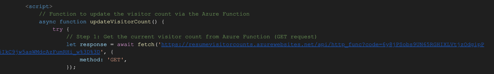

# Azure Cloud Resume Challenge

**Alright I'm starting this challenge over from scratch because I don't remember it. Lets take it on a day-by-day basis.**

## 02.01.2025

**Today's Topics**
* Steps 1 - X

Chunk 3: Front-end / back-end integration

Step 7 - Javascript 

Here, we're creating our Visitor Counter indicator. We're assigning it an Id so we can alter the counter number later on in the script. Think of a ID sort of like a variable we can call on later. 

Chunk 2: Building the API

Step 13 - Source Control

I skipped the source control, CI/CD, and IaC parts of this challenge. I didn't want to break everything I've done so far. If you want my experience on these topics, I'll be completing another project that showcases this skillset. 

Step 10 - Python

Now, we have to write our Python code for reaching out to our Cosmos DB table. Before we do this, lets import a few more modules. We'll import modules for storing the Table API details such as the endpoint, key, account name and table name. Then, we'll store these credentials in a variable. We'll pass these variables to the Table Client module functions so when our HTTP Trigger is launched, Azure Functions will automatically connect to our Cosmos DB Table. 

Within our function, we're only going to have two simple parts of our code (which we'll expand on later with unit tests) but we're going to simply GET the value of website visit counter, pass it to our Javascript code in our HTML file (which will increment it by 1 and pass it back to the Python file) and then POST it back to the DB table. We're using the Table Client module functions to interact with the Table entity and count value. The `req` object has methods that will let us know if the request was a GET or a POST. When someone visits the website, it should be a GET request. When the Javascript increments the counter, the request should be a POST. When it's a GET, we'll just returnt the value of the current count. When it's a POST, we're going to us the `req.get_json()` object and method to retrieve the JSON information from our incoming POST request. This should have the new count incremented by our Javascript code. We'll pass this information to a new variable and get the count information using the `.get('count')` method associated with out new variable. we'll assign this to a new variable called `new_count` and then pass this to our Table Client to give back to our Cosmos DB Table. 

Now, obviously we'll go over the Javascript code later but this is essentially how we'll GET and POST our visitor counter information. 

Step 9 - API

Here's where things start to get very interesting. We're going to use Azure Functions with an HTTP Trigger to make this part of the code work. So lets break this down as much as possible. We can think of Azure Functions as a PaaS (I think) where this service provides all the underlying infrastructure for us to just run a piece of code (in our case, Python). There's an Azure Function App that acts as a container that stores all of your Azure Functions in one place. So when you deploy the Azure Function App, you then have to create an HTTP Trigger instance of it. I believe this app itself has a public endpoint and you can route traffic through this endpoint to call to your specific function in the accompanying source files. 

Lets talk about the source files. When you create an instance of the Azure function (at least for the HTTP trigger), it will generate a few files for you such as `__init__.py` (where you are given a template code and this is where I will write my code), `host.json`, `function.json`, and etc. These files are stored IN Azure. While you can use Visual Studio Code (VSC) to edit these files locally on your device, you'll have to deploy them back to Azure so Azure can run them. Lets keep that in mind. 

So you can use VSC to get this entire process started. Download the Azure SDK and Azure Functions extensions in VSC so you can work with these files locally in your code editor. Once you do that, deploy an Azure Functions App (I named my ResumeVisitorCounts) and select the newest version of Python you can. I set the auth level to function (lets review why I did this). After that, you should have generate template for your HTTP trigger function located in your `__init__.py` file. You can change the name of this by the way but you'll have to specify this in `function.json` file in the scriptFile key-value. I changed mine to `function_app.py`. 

Lets talk about the basic HTTP trigger template you're given. You're given a few modules that are imported such as logging. Logging is important because it sends these log messages to a storage container for you to use later if anything happens with your app. You're also given the `azure.functions` module which will help you manipulate the HTTP information in your code. When you visit a website, this request is usually a GET or a POST (usually a GET) and all of your information is stored in a JSON file. The azure.functions module helps you manipulate the data in this JSON file. You're given a function named main that will accept a the GET JSON information in an object called `req` using the the azure.functions.HttpRequest method (Azure automatically gives your module an alias called `func` so we will be using this naming instead. 

Azure Apps automatically calls this function when someone visits your endpoint so you don't have to call it yourself. The generic template will allow you to pass a name arguement to the Azure function endpoint URL and it will display a message depending on if you give it a name or not. This is a way for you to test your endpoint and the code to make sure that it's working. 

**************************** Talk about the additional files in the HTTP Trigger when you get a chance. 

Step 8 - Database

So, lets get started with the API part. We deployed a Cosmos DB with Tables in order to store our counter value. If you hed to Data Explorer, you can create a new Table (which I called `TablesDB`) and then create a partition under these tables (which I called `VisitorCounts`) and then in entities, you can create your value which would just be `count` for our project. That concludes the DB being created! Now, we'll have to keep a record of the names and account keys and connection strings for the DB to use our Python code with it. You can find this under the Settings blade nad then clicking on the Connection strings tab. It should display the Account Name, Endpoint URL, and keys, and connection strings. Think of the connection string as a shortcut that includes both the endpoint and the key. The endpoint gets you to the DB and the key gets you inside the DB. 

Chunk 1: Building the Frontend

Step 6 - Azure DNS

Okay now this part was annoying. As a network engineer, I should know more about DNS but I don't. So we wanted to make sure we have our custom domain and Azure CDN public endpoint coincided. So the first thing I had to do was go ahead and buy a domain name which I wen to Cloud Flare to accomplish. 

Next, we had to deploy Azure DNS and get our name servers. Azure gives you 4 name servers that all sound very similar but that's okay. In Azure DNS, we had to add our Azure storage account public URL to these records. We had to add the given one and the `www` CNAME record as well. 

I'm going to jump ahead a bit here but we went into Cloud Flare and added CNAME records for our custom domain name to be linked to our Azure Functions App. We also added the 4 Azure DNS name servers to our Cloud Flare setup using the NS record type and pointed them towards our custom domain. 

Now, the thing about DNS is it takes a while to propagate so this can take up to a day or two for your custom domain name to be accessible. So if you get it wrong, you can't really tell. It was very frustrating but eventually I got it to work. 

Step 5 - HTTPS

We need to make sure our website is using HTTPS for a secure connection. We'll use Azure CDN for this. I know this is Azure Content Delivery Network. I need to go back over exactly what this is used for although I know it makes your content easily assessible to users across the globe because it distributes the content at a location nearest to the user. I still have to review the HTTPS part. 

Now, we use Azure CDN for HTTPS on the static website because the Azure storage account where your static website is hosted doesn't natively support HTTPS with custom domains. We eventually want to use a custom domain so we can have a cool sounding website. So we have to deploy an Azure CDN and attach it to our static website public endpoint to it. This will give us a new endpoint name with a different domain but it gives us the ability to connect to this endpoint using HTTPS. 

Step 4 - Static Website

Now we have to deploy our code to a static webpage in Azure. I kind of already had this set up as well. You have to go to your storage account in the Overview blade, you have to go to Capabilities and then select Static website. Here, you can find the link to your Static website with your `index.html` file. I already uploaded the HTML and CSS files to my `$web` container in my blob storage so when you copy the primary endpoint and paste it in your URL, it should take you to your Static webpage. 

This part was pretty easy. You can just click on the public endpoint and your HTML file with the CSS styling will pop right up! 

Step 2 & 3 - HTML & CSS

I need to write some HTML code for this portion to work. I've already done this but I really need to update my resume so I'm going to take the time to do that now. 

I had to go back over a refresher for HTML to see which parts I wanted to edit. I had to update my work experience which was pretty much copy and paste but I also had to realign my bullet points. I edited the bullet point placement in my CSS file. I was also encountering some weird issue where my LinkedIn Profile and my GItHub repo link wouldn't be on separate lines so I went ahead and used ` ` to break them apart. I had to use a ton of `&nbsp` to space out the text though. My HTML code is so ugly. 

But it works. 

Just a quick recap of HTML, you have the document type `<!DOCTYPE HTML>` that will tell your web broswer what type of file it's working with. THen you have the `<html>` indicator that all of your HTML code will sit in. Then you have two major sections after this. You have the `<head>` tpe which will just kind determined the main page information such as the language and things of that nature. After that, you have the meat and potatoes which is the `<body>`. This is where all of your smaller document types such as your header `<h1>`, paragraph `
`, links `<a>`, list `<li>, and other things. These are the main ones I used for my document. You can also assign class values to each of these document types so when you start to create your CSS file, those style configurations will apply to all of the document types that have that class specified in them. This just makes things easier to manage. 

To link your HTML file to your CSS file, use the syntax `link rel="stylesheet" href="<name_of_CSS_file>`. I believe these files need to be in the same directory so whatever CSS configurations you do, it will shape the HTML file. 

This section was a very new learning experience but it wasn't difficult. If anything, the most difficult portion was making sure the spacing was right which I'm still have a few issues with. I had to keep use the `&nsbp` or whatever the spacing was to make sure was formatted correctly. Very annothing. 

Step 1 - Azure Certification

The first step of this project is to get an Azure certification. I have two Azure certifications: AZ - 900 and AZ - 104 so I'm definitely done with this portion of the project. I will be periodically reviewing the AZ - 104 labs and going into the AZ - 305 labs as well as the AZ - 700 course but that will be later. 

Step completed!
